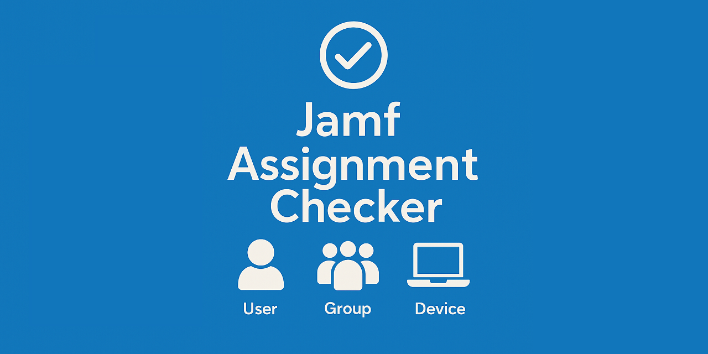

# 🔍 JAMF Assignment Checker

<div align="center">
  
  
  <p>
    <a href="https://twitter.com/jorge2990">
      
    </a>
    <a href="https://www.linkedin.com/in/jorgeasaurus/">
      
    </a>
  </p>
</div>

A PowerShell-based utility for analyzing and auditing JAMF Pro policy and configuration profile assignments. This tool enables IT administrators to efficiently analyze assignments for specific computers, users, or groups, identify unassigned policies, detect empty groups, and audit the overall assignment landscape in JAMF Pro environments.

## 📑 Table of Contents

- [🚀 Quick Start](#-quick-start)
- [✨ Features](#-features)
- [📋 Prerequisites](#-prerequisites)
- [🔐 Authentication Options](#-authentication-options)
- [📖 Usage](#-usage)
- [💻 Command-Line Examples](#-command-line-examples)
- [📊 HTML Reports](#-html-reports)
- [🤝 Contributing](#-contributing)
- [📄 License](#-license)

## 🚀 Quick Start

> **Important**: All commands must be run in a PowerShell 7.0+ session. The script will not work in PowerShell 5.1 or earlier versions.

### Basic Setup

1. **Clone the repository:**
   ```powershell
   git clone https://github.com/jorgeasaurus/JamfAssignmentChecker.git
   cd JamfAssignmentChecker
   ```

2. **Configure authentication:**
   ```powershell
   # Copy the template and edit with your JAMF Pro credentials
   Copy-Item config.ps1.template config.ps1
   # Edit config.ps1 with your JAMF Pro server details
   ```

3. **Run the script:**
   ```powershell
   .\JamfAssignmentChecker.ps1
   ```

## ✨ Features

### 🎯 Core Assignment Analysis
- ✅ **Computer Assignment Checking** - Analyze policies and profiles for specific macOS computers
- ✅ **Mobile Device Assignment Checking** - Analyze profiles for iOS/iPadOS devices
- ✅ **Policy Overview** - Display all policies with their assignments and scope
- ✅ **Configuration Profile Analysis** - Both macOS and mobile device profiles
- ✅ **Unassigned Resource Detection** - Find policies and profiles without assignments
- ✅ **Group Analysis** - Computer and mobile device groups with member counts
- ✅ **Exclusions Analysis** - Detailed scope exclusion tracking and reporting

### 📊 Reporting & Export
- ✅ **Interactive HTML Reports** - Bootstrap-styled reports with DataTables, charts, and filtering
- ✅ **CSV Export** - Clean, structured data export without duplicates
- ✅ **Assignment Matrix View** - Visual representation of assignment relationships
- ✅ **Executive Summary** - Key metrics and compliance gap analysis
- ✅ **Chart Visualizations** - Policy distribution and resource type charts
- ✅ **Dynamic Filtering** - Real-time search and assignment type filtering
- ✅ **Responsive Design** - Mobile-friendly report layouts

### 🔧 Technical Capabilities
- ✅ **Standalone PowerShell Script** - Complete solution with modular function structure
- ✅ **Multi-Authentication Support** - Username/password and OAuth client credentials
- ✅ **Smart Group Evaluation** - Analyze smart group criteria and memberships
- ✅ **Scope Analysis** - Inclusion and exclusion scopes for policies and profiles
- ✅ **Error Handling** - Comprehensive error handling and retry logic
- ✅ **Progress Indicators** - Visual feedback for long-running operations

### 🌐 Platform Support
- ✅ **macOS Computers** - Full policy and configuration profile support
- ✅ **iOS/iPadOS Mobile Devices** - Complete configuration profile support with user assignments
- ✅ **User Assignments** - Full support for mobile device profile user assignments (JSS users)
- ✅ **Mobile Device Groups** - Complete support for mobile device group assignments
- ✅ **Building Assignments** - Support for location-based mobile device assignments
- 🚧 **User Assignment Analysis** - Data retrieval implemented, specific user analysis pending
- 🚧 **Groups** - Partial support (data retrieval implemented, detailed analysis pending)

## 📋 Prerequisites

### Required PowerShell Version
- **PowerShell 7.0 or higher is required**
  - Check your version: `$PSVersionTable.PSVersion`
  - Download PowerShell 7: https://aka.ms/powershell-release?tag=stable

### Required JAMF Pro Permissions
Your JAMF Pro user account or API client needs the following minimum permissions:

#### Read Permissions Required:
- **Computers**: Read access to computer inventory and group memberships
- **Users**: Read access to user information and group memberships  
- **Computer Groups**: Read access to static and smart computer groups
- **User Groups**: Read access to user groups
- **Policies**: Read access to policy configuration and scope
- **macOS Configuration Profiles**: Read access to configuration profiles and scope
- **Mobile Device Configuration Profiles**: Read access to mobile configuration profiles
- **Computer PreStages**: Read access to prestage configurations
- **Mobile Device PreStages**: Read access to mobile prestage configurations

## 🔐 Authentication Options

### Option 1: Basic Authentication (Username/Password)

Configure your `config.ps1` file:

```powershell
$Config = @{
    BaseUrl = "https://yourcompany.jamfcloud.com"
    Username = "your_username"
    Password = "your_password"
    ClientId = ""              # Leave empty for Basic Auth
    ClientSecret = ""          # Leave empty for Basic Auth
    ApiVersion = "classic"
    DataFolder = "C:\JamfReports"
}
```

### Option 2: OAuth Client Credentials (Recommended for automation)

1. **Create API Client in JAMF Pro:**
   - Navigate to Settings > System > API Roles and Clients
   - Create new API Role with required read permissions
   - Create new API Client and assign the role
   - Note the Client ID and Client Secret

2. **Configure authentication:**
   ```powershell
   $Config = @{
       BaseUrl = "https://yourcompany.jamfcloud.com"
       Username = ""           # Leave empty for OAuth
       Password = ""           # Leave empty for OAuth  
       ClientId = "your_client_id"
       ClientSecret = "your_client_secret"
       ApiVersion = "classic"
       DataFolder = "C:\JamfReports"
   }
   ```

### Authentication Priority

The script uses the following authentication priority:
1. **config.ps1 file** (primary method)
2. **Command-line parameters** (override capability)
3. **Interactive prompts** (fallback)

## 📖 Usage

### 🖥️ Interactive Mode

Run the script without parameters for a menu-driven interface:

```powershell
.\JamfAssignmentChecker.ps1
```

**Menu Options:**
1. Check assignments for specific computer(s)
2. Check assignments for specific user(s) *(Coming Soon)*
3. Check assignments for specific group(s) *(Coming Soon)*  
4. Check assignments for specific mobile device(s)
5. Show assignments for ALL computers in environment (exports to CSV)
6. Show assignments for ALL users in environment (exports to CSV)
7. Show all policies and their assignments (exports to CSV)
8. Show all configuration profiles and their assignments  
9. Find policies without assignments
10. Find configuration profiles without assignments
11. Find empty groups in assignments *(Coming Soon)*
12. Generate comprehensive HTML report

## 💻 Command-Line Examples

### Computer Assignment Analysis
```powershell
# Check single computer
.\JamfAssignmentChecker.ps1 -CheckComputer -ComputerNames "MacBook-001"

# Check multiple computers with CSV export
.\JamfAssignmentChecker.ps1 -CheckComputer -ComputerNames "MacBook-001,MacBook-002" -ExportToCSV -ExportPath "C:\Reports\ComputerAssignments.csv"

# Show assignments for ALL computers in environment
.\JamfAssignmentChecker.ps1 -ShowAllComputerAssignments -ExportToCSV -ExportPath "C:\Reports\AllComputerAssignments.csv"
```

### Mobile Device Assignment Analysis
```powershell
# Check mobile device assignments
.\JamfAssignmentChecker.ps1 -CheckMobileDevice -MobileDeviceNames "iPad-001" -ExportToCSV

# Show assignments for ALL users in environment
.\JamfAssignmentChecker.ps1 -ShowAllUserAssignments -ExportToCSV -ExportPath "C:\Reports\AllUserAssignments.csv"
```

### Policy and Profile Overview
```powershell
# Show all policies with assignments
.\JamfAssignmentChecker.ps1 -ShowAllPolicies -ExportToCSV

# Show all configuration profiles
.\JamfAssignmentChecker.ps1 -ShowAllProfiles -ExportToCSV

# Find unassigned resources
.\JamfAssignmentChecker.ps1 -FindUnassignedPolicies -ExportToCSV
.\JamfAssignmentChecker.ps1 -FindUnassignedProfiles -ExportToCSV
```

### HTML Report Generation
```powershell
# Generate comprehensive HTML report
.\JamfAssignmentChecker.ps1 -GenerateHTMLReport -ExportPath "C:\Reports\JamfReport.html"

# Generate with custom authentication
.\JamfAssignmentChecker.ps1 -GenerateHTMLReport -Server "company.jamfcloud.com" -Username "admin" -Password "password"
```

### Available Parameters

| Parameter                     | Description                                    |
| ----------------------------- | ---------------------------------------------- |
| `-CheckComputer`              | Check assignments for specific computers       |
| `-ComputerNames`              | Computer names to check (comma-separated)      |
| `-CheckMobileDevice`          | Check assignments for mobile devices           |
| `-MobileDeviceNames`          | Mobile device names to check (comma-separated) |
| `-CheckUser`                  | Check assignments for users *(Coming Soon)*    |
| `-UserNames`                  | User names to check *(Coming Soon)*            |
| `-CheckGroup`                 | Check assignments for groups *(Coming Soon)*   |
| `-GroupNames`                 | Group names to check *(Coming Soon)*           |
| `-ShowAllComputerAssignments` | Show assignments for ALL computers             |
| `-ShowAllUserAssignments`     | Show assignments for ALL users                 |
| `-ShowAllPolicies`            | Display all policies and assignments           |
| `-ShowAllProfiles`            | Display all configuration profiles             |
| `-FindUnassignedPolicies`     | Find policies without assignments              |
| `-FindUnassignedProfiles`     | Find profiles without assignments              |
| `-FindEmptyGroups`            | Find empty groups *(Coming Soon)*              |
| `-GenerateHTMLReport`         | Generate comprehensive HTML report             |
| `-ExportToCSV`                | Export results to CSV                          |
| `-ExportPath`                 | Path for exported files                        |
| `-Server`                     | JAMF Pro server URL                            |
| `-Username`                   | Username for authentication                    |
| `-Password`                   | Password for authentication                    |
| `-ClientId`                   | OAuth client ID                                |
| `-ClientSecret`               | OAuth client secret                            |

## 📊 HTML Reports

<div align="center">
  
</div>

The HTML report generation creates **enterprise-grade**, interactive reports featuring:

### 📈 Executive Dashboard
- **Summary Statistics** - Policy, profile, and assignment counts
- **Visual Charts** - Policy distribution and resource type breakdowns using Chart.js
- **Assignment Coverage Metrics** - Visual indicators for unassigned resources
- **Real-time Filtering** - Dynamic search and assignment type filtering

### 🔍 Interactive Tables
- **DataTables Integration** - Professional table functionality with pagination
- **Search and Filter** - Real-time filtering across all tables
- **Export Capabilities** - Built-in CSV, Excel, and copy functionality
- **Responsive Design** - Works perfectly on desktop, tablet, and mobile devices

### 📋 Comprehensive Data Views
- **All Policies & Profiles** - Unified view with type indicators and assignment details
- **Policies Overview** - All policies with assignment details and enabled/disabled status
- **Configuration Profiles** - Both macOS and mobile device profiles with complete assignment data
- **Mobile Device Profiles** - iOS/iPadOS profiles with user, group, and building assignments
- **User Assignments** - Full support for mobile device profile user assignments (JSS users)
- **Mobile Device Groups** - Complete mobile device group assignment tracking
- **Building Assignments** - Location-based assignment support for mobile devices
- **Exclusions Column** - Dedicated column showing detailed exclusion information
- **Unassigned Resources** - Policies and profiles without any assignments

### 🎨 Professional Styling
- **JAMF Orange Branding** - Custom color scheme matching JAMF aesthetics
- **Bootstrap 5** - Modern, responsive framework
- **Color-coded Badges** - Assignment type indicators (All Computers, Computer Groups, User, Mobile Device Groups, Building, etc.)
- **Clean Typography** - Easy-to-read tables with professional styling
- **Interactive Elements** - Hover effects and smooth transitions

### 📊 Chart Visualizations
- **Policy Distribution Pie Chart** - Assignment type breakdown
- **Resource Types Bar Chart** - Policies vs. profiles distribution
- **Responsive Charts** - Mobile-friendly visualizations

### Example Report Features
```
📊 JAMF Assignment Report
Generated on June 30, 2025 08:59

Summary Cards:
• Total Policies: 27 | Total Profiles: 60 | All Computers: 16
• Group Assigned: 34 | User Assigned: 1 | Unassigned: 30

Assignment Types Supported:
• All Computers • Computer Groups • Computer (Direct)
• Mobile Device Groups • User • Building • Exclusions

Interactive Features:
• Search by group name
• Filter by assignment type (including User and Mobile Device Group)
• Export to CSV/Excel
• Mobile-responsive design
• Real-time data filtering
• Color-coded assignment badges
```

## 🚧 Development Status

**Current Status: 93% Complete (14/15 tasks completed)**

### ✅ Completed Features
- ✅ **Core infrastructure and computer analysis** - Full assignment checking for macOS computers
- ✅ **Mobile device support and profile management** - Complete iOS/iPadOS configuration profile analysis
- ✅ **Policy and profile overview functionality** - Comprehensive resource listing with assignments
- ✅ **Unassigned resource detection** - Identify policies and profiles without assignments
- ✅ **CSV export capabilities** - Clean, structured data export without duplicates
- ✅ **Modular function structure** - Clean, organized PowerShell functions in separate files
- ✅ **Interactive HTML report generation** - Bootstrap-styled reports with DataTables and Chart.js
- ✅ **Exclusions analysis** - Dedicated column and tracking for assignment exclusions
- ✅ **Multi-authentication support** - Username/password and OAuth client credentials
- ✅ **Error handling and progress indicators** - Robust user experience with visual feedback
- ✅ **Group data retrieval** - Computer and mobile device groups with member counts
- ✅ **Dynamic filtering and search** - Real-time table filtering and assignment type selection
- ✅ **Professional styling and branding** - JAMF-specific color scheme and responsive design
- ✅ **Mobile device profile user assignments** - Complete support for JSS user assignments, mobile device groups, and building assignments

### 🚧 Remaining Tasks (1 item)
- 🚧 **Empty group detection** - Find groups without members in assignments

### 📅 Future Enhancements
- **Real-time monitoring** - Continuous assignment change tracking
- **Assignment recommendations** - AI-powered optimization suggestions
- **Compliance scoring** - Automated coverage assessment
- **Web interface** - Browser-based tool for non-PowerShell users

## 🔧 Advanced Configuration

### Custom Report Templates
The HTML reports can be customized by modifying the CSS and JavaScript in the `Generate-HTMLContent` function.

### API Rate Limiting
The tool includes automatic retry logic and respects JAMF Pro API rate limits.

### Large Environment Optimization
For environments with 100+ groups, member count fetching can be disabled for better performance:
```powershell
$computerGroups = Get-JamfComputerGroups -IncludeMemberCounts:$false
```

### Logging and Debugging
Enable verbose logging by modifying the script's error handling sections.

## 🤝 Contributing

Contributions are welcome! Please feel free to submit issues and pull requests.

### Development Guidelines
- Follow PowerShell best practices
- Include error handling for all API calls  
- Add progress indicators for long-running operations
- Update documentation for new features
- Test with both authentication methods

### Reporting Issues
When reporting issues, please include:
- PowerShell version (`$PSVersionTable.PSVersion`)
- JAMF Pro version
- Authentication method used
- Error messages and stack traces
- Steps to reproduce

## 🙏 Acknowledgments

- **ugurkocde/IntuneAssignmentChecker** - Inspiration and proven assignment analysis patterns
- **jorgeasaurus/PsJamfBackupRestore** - Foundation for JAMF API integration and authentication
- **JAMF Software** - For providing comprehensive APIs for automation and integration

---

**Ready to optimize your JAMF Pro assignments?** 🚀

Start with the [Quick Start](#-quick-start) guide and explore your JAMF environment like never before!